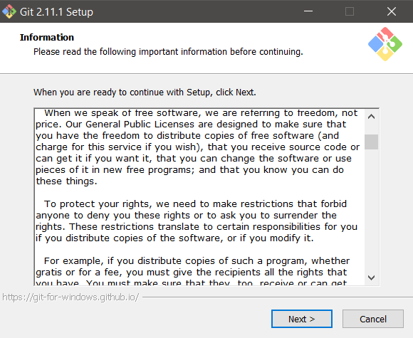

Instalación de aplicaciones
==

A continuacion veremos una sencilla guia de como instalar las siguientes aplic

##NodeJS

**NodeJS** es un entorno de ejecución para JavaScript construido con el motor de JavaScript V8 de Chrome. Node.js usa un modelo de operaciones E/S sin bloqueo y orientado a eventos, que lo hace liviano y eficiente.

El cual se puede descargar desde el siguiente enlace [nodejs.org](https://nodejs.org/es/download/).

###Instalacion

Para instalar NodeJS descargamos el instalador de la pagina oficial para nuestro sistema operativo desde el enlace anterior y procedemos a ejecutarlo.

Seguimos los pasos indicados en el instalador los cuales nos permitiran ejecutar los comandos "npm" y "node" en la terminal.

Para verificar la instalacion de NodeJS, abrimos una terminal y ejecutamos el comando:<pre>node --version</pre>

Y el comando: <pre>npm -v</pre>

Al obtener la salida de los dos comandos con las versiones de node y npm respectivamente podemos confirmar la instalacion de los dos comandos.

##Git/Git for Windows

**Git** es un software de control de versiones, pensando en la eficiencia y la confiabilidad del mantenimiento de versiones de aplicaciones cuando éstas tienen un gran número de archivos de código fuente.

Para instalar git para Windows en [Git-for-Windows](https://git-scm.com/download/win) y para Mac en [Git-for-Mac](https://git-scm.com/download/mac).

###Instalación

Para las instalaciones en Windows y en Mac procedemos a seguir la instrucciones y seleccionar preferencias con las que deseamos instalar Git.

Para instalar instalar en un sistema Debian/Ubuntu lo podremos hacer con el siguiente comando: 
<pre>sudo apt-get install git </pre>
En caso de tener otra distribución de Linux visita este enlace para poder instalar [Git](https://git-scm.com/download/linux).

Para comprobar la instalación ejectamos en la terminal el comando: <pre> git --version </pre>

##